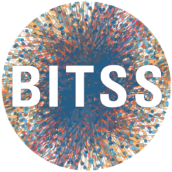

### The problem
Open research practices have the potential to benefit the entire research community, but could also be perceived by certain individuals as a threat to their career under the ‘publish-or-perish’ paradigm. For example, the widespread sharing of data and code could allow researchers to validate and build on each others’ work more efficiently, thus saving countless hours of duplicated effort, but some individuals may worry that doing so will place them at a competitive disadvantage. Similarly, the widespread support for platinum open access systems could drastically decrease publication costs and place the control of scholarly communication in the hands of researchers, rather than publishers, but individuals may worry that these outlets do not confer sufficient prestige to ensure their survival in a competitive job market. Academic reform thus reflects a ‘collective action problem’, whereby a group of individuals fail to reach a preferable state due to conflicting interests at the personal level. Historically, problems of this kind have often been resolved through ‘collective action’, whereby a group of individuals act in unison to create cultural change while protecting each others' interests through solidarity (e.g., industrial workers' strikes). In the digital age, 'crowdfunding' (e.g., Kickstarter) and 'crowdacting' platforms (Collaction) have shown that collective action can now be organised at the click of a button, all the while protecting the identity of individual pledgers. Despite these successes, however, the global research community does not yet have a flexible mechanism to organise collective action within its ranks. Free Our Knowledge aims to become that mechanism.

### The vision
Project Free Our Knowledge aims to create positive cultural change by organising collective action in the global research community. Using this website, researchers can signal their intentions to adopt progressive research behaviours *if and when there is a pre-determined level of support in the community*. Pledges remain inactive and anonymous if the threshold is not met, thus protecting individuals from potential repercussions. Once the threshold is met, however, the pledging community will be revealed on the website and directed to carry out the action in unison, thus protecting one another's interests as they create change together. Campaign targets will be modest in the short term, e.g., asking hundreds of researchers to post a preprint or complete a preregistration. But over time, as the movement grows, campaigns could grow increasingly bolder in both size and scope, eventually culminating in widespread systemic change and optimising the speed with which we can make progress on important issues of our time (e.g., pandemics, climate change).

### How to get involved
Take a look at the various campaigns posted on our [landing page](https://freeourknowledge.org/) and pledge to any that you're interested in. New campaigns are currently being developed on our [Github repository](https://github.com/FreeOurKnowledge/community/issues). If you see something there that you're interested in, please make a comment or 'thumbs up' the original post to help us decide which campaigns have the most community traction. Or if you have an idea for a campaign that hasn't been proposed, feel free to propose it by [opening a new issue](https://github.com/FreeOurKnowledge/community/issues/new/choose). We hope that diverse communities of individuals will come together to decide what they think the future of academia should look like and then collaborate to make it happen, so please join us in developing future campaigns for the website.

We'd also love it if you could follow us on [Twitter](https://twitter.com/projectFOK) and [Facebook](https://www.facebook.com/projectFOK), share our posts and sign up to our [mailing list](http://eepurl.com/dFVBVz). And obviously, tell your friends and colleagues! Alone we may be weak, but together we are strong.

### Partner organisations
   
  
 
