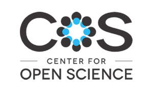
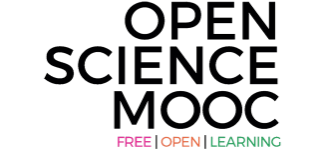
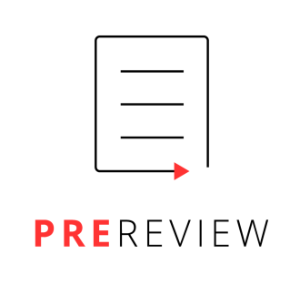

<iframe align=middle align="middle" width="560" height="315" src="https://www.youtube.com/embed/vzB7Vh_gkLs" frameborder="0" allow="accelerometer; autoplay; clipboard-write; encrypted-media; gyroscope; picture-in-picture" allowfullscreen></iframe>

### Why is this project needed?
Academic reform is hindered by a collective action problem. Many open science practices offer benefits to the entire research community (and beyond), but their adoption is limited by incentive structures that reward closed science and ‘prestigious’ publications at the individual level. Historically, collective action -- the simultaneous adoption of new behaviours by a subset of the community in question -- has proven to be an effective strategy for aligning personal and group incentives across a wide range of contexts (e.g., factory workers going on strike; consumers contributing funds to a Kickstarter product), but remains to be implemented in a meaningful way by the research community. 

### How are we planning to fix this problem?
Project Free Our Knowledge aims to create positive cultural change by organising collective action in the global research community. Using our website, researchers can make anonymous pledges to support open science behaviours *if and when a critical mass of support for that behaviour is met in the community*. Then -- after the pre-determined number of pledges is reached -- the new community will be publicised on the website and directed to carry out the action in unison, thus protecting each other’s interests as they drive progress together.

### What is our vision for the future? 
We anticipate that campaign targets will be modest in the short term, e.g., asking tens or hundreds of researchers to commit to a single action. These actions could occur at any stage of the research pipeline (e.g., completing a preregistration or posting a preprint) or beyond (e.g., forming a local support group for mental health, or changing one's hiring priorities). In this way, we hope that this platform will be useful in a variety of ways by different communities, who can use it to advance their own missions. Over time, we envisage that campaigns could eventually grow progressively larger and bolder as the movement grows. Eventually, it is conceivable that large swathes of a research community could decide on new sets of rules that they want to play by, and create systemic change through widespread collective action. 

### How you can get involved
Take a look at the various campaigns posted on our [landing page](https://freeourknowledge.org/) and pledge to those that you're interested in. New campaigns are currently being developed on our [Github repository](https://github.com/FreeOurKnowledge/community/issues). If you see something there that you're interested in, please make a comment or 'thumbs up' the original post to help us decide which campaigns have the most community traction. Alternatively, if you have an idea for a campaign that hasn't been proposed, feel free to propose it by [opening a new issue](https://github.com/FreeOurKnowledge/community/issues/new/choose). We'd also love it if you could follow us on [Twitter](https://twitter.com/projectFOK) and [Facebook](https://www.facebook.com/projectFOK), share our posts and sign up to our [mailing list](http://eepurl.com/dFVBVz). And obviously, tell your friends and colleagues! Alone we may be weak, but together we are strong.

### Who are we?
Project Free Our Knowledge is a grassroots movement being driven by early career researchers who seek a better future for our friends, colleagues and ourselves as we pursue careers in academia. We hope that diverse communities of individuals will come together to decide what the future of academia should look like *and then cooperate to make it happen*. At present, the project is being driven by:

* [Cooper Smout](https://www.coopersmout.com/) (Primary lead)
* [Dawn Liu Holford](https://www.essex.ac.uk/people/liuda52701/dawn-holford) (Secondary lead)

Supported by:

* Jay Patel
* Megan Campbell
* Kelly Garner
* Claire Bradley
* Udi Alter
* Gavin Taylor

And advised by:

* Luis Pedro Coelho
* Lillian Juma
* Alex Holcombe
* Brian Nosek

The [first version of the platform](https://github.com/FreeOurKnowledge/old_platform) was built by Codi Coop and [the current version](https://github.com/FreeOurKnowledge/website) was built by Cooper Smout using [Dean Attali's Beautiful Jekkyl template](https://github.com/daattali/beautiful-jekyll).

### Partner organisations
The following organisations have agreed to help Project Free Our Knowledge reach wider audiences through their networks. We are grateful for their support.
   
  
 
